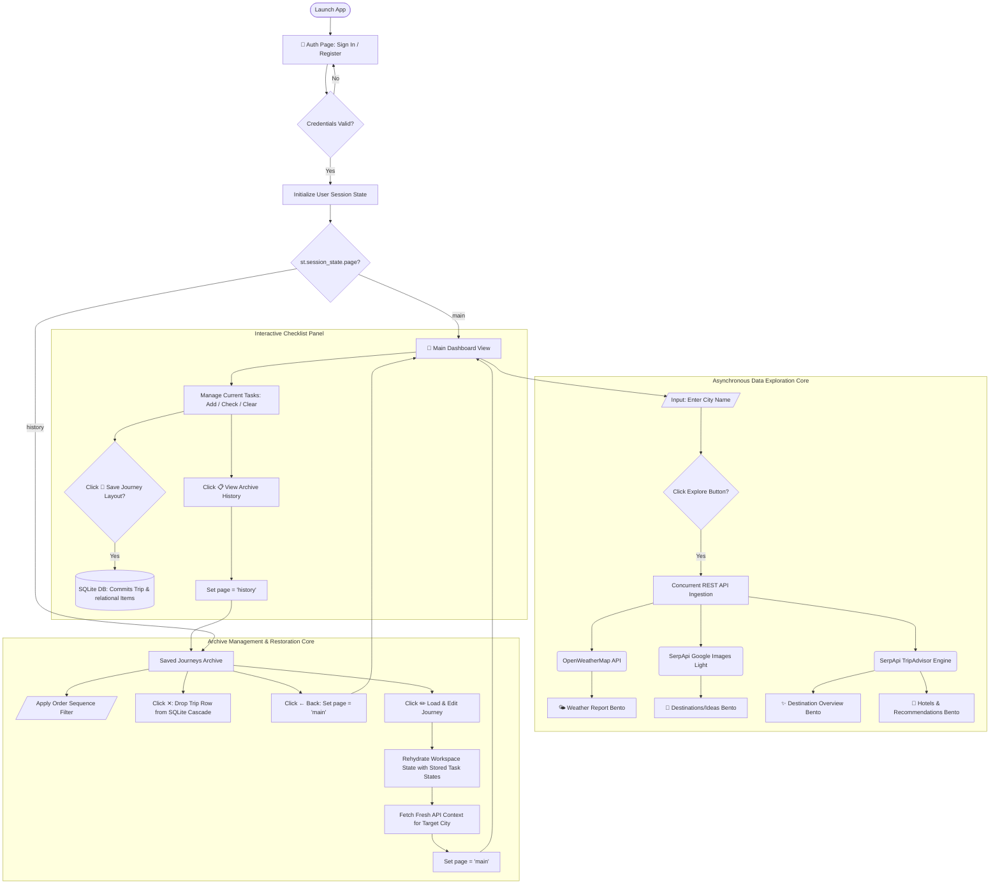

# 🧭 Seyahatify — Minimalist Trip Planner

Seyahatify is a lightweight, responsive travel workspace application built with **Streamlit** and driven by a relational **SQLite3** engine. Designed with a sleek, iOS-inspired glassmorphic bento block layout, it helps travelers concurrently coordinate dynamic destination data profiles alongside synchronized task management pipelines.

---

## 🛠️ Tech Stack & Integrations

* **Frontend Engine:** Streamlit (Custom styled layout leveraging modern CSS styling vectors).
* **Database Infrastructure:** Local SQLite3 instance tracking relational schema instances.
* **Live Context APIs:**
* **OpenWeatherMap API:** Dynamic data extraction for temperature trends, feels-like thresholds, local cloud parameters, and metric tracking.
* **SerpApi TripAdvisor Engine:** Automatically processes descriptive strings, tourist evaluations, location review analytics, and structural lodging alternatives.
* **SerpApi Google Images Light Engine:** Direct visual item lookups routing dynamic discoveries straight into custom UI asset blocks.


---

## 💾 Relational Data Architecture

The application runs a normalized backend data layout to safeguard user profiles and active itineraries across active sessions:

```text
  [users] ───(1:N)───> [trips] ───(1:N)───> [trip_items]
   ├── id (PK)          ├── id (PK)           ├── id (PK)
   ├── username         ├── user_id (FK)      ├── trip_id (FK)
   └── password         └── city              ├── item (TEXT)
                                              └── checked (BOOLEAN)

```

---

## 📈 System Architecture & Interaction Flow

The architectural lifecycle below highlights user validation pathing, asynchronous data ingestion channels, panel segmentation matrices, and state recovery cycles:



---

## 🌟 Core Functional Capabilities

### 1. Robust Access Shield

Employs an isolated user directory infrastructure allowing custom traveler account registrations. Session data states maintain distinct user operational profiles, shielding private itineraries from concurrent platform connections.

### 2. Multi-Panel Destination Matrix

* **Weather Report:** Monitors temperatures, humidity levels, and cloud configurations in real time.
* **Destinations/Ideas:** Leverages targeted, low-latency visual queries to show key location details complete with social media sharing utilities.
* **Destination Overview & Lodging:** Ingests traveler sentiment scores and localized review snippets, exposing multiple hospitality choices side by side.

### 3. State Rehydration & Edit Pipeline

The **Load & Edit Journey** protocol lets users load legacy checklists back into the primary panel loop instantly. Selecting it maps old checkboxes back to their exact historical states while executing live data fetches—allowing old travel strategies to instantly receive fresh updates.
